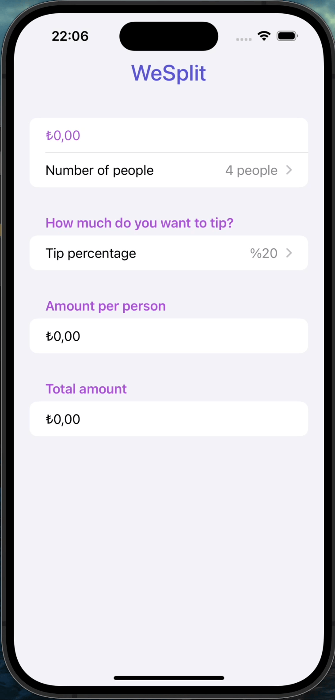

# 100 Days of SwiftUI
This GitHub repository showcases projects I built during the 100 Days of SwiftUI course. Each project tackles a distinct facet of SwiftUI, providing me with in-depth, practical experience.  

"This course has been prepared by Paul Hudson."  
For details: https://www.hackingwithswift.com/100/swiftui

# All Projects
- ### [Project 1: WeSplit](https://github.com/DenizGokayHamzali/100-Days-of-SwiftUI/tree/main/WeSplit-Project-01) & [Day 16 - 18](https://www.hackingwithswift.com/100/swiftui/16)

  

#

- ### [Challenge 1: UnitConverter](https://github.com/DenizGokayHamzali/100-Days-of-SwiftUI/tree/main/UnitConverter-Challenge-01) & [Day 19](https://www.hackingwithswift.com/100/swiftui/19)

  

#

- ### [Project 2: GuessTheFlag](https://github.com/DenizGokayHamzali/100-Days-of-SwiftUI/tree/main/GuessTheFlag-Project-02) & [Day 20 - 22](https://www.hackingwithswift.com/100/swiftui/20)

  

#

- ### [Milestone 1: RockPaperScissors](https://github.com/DenizGokayHamzali/100-Days-of-SwiftUI/tree/main/RockPaperScissors-Milestone-01) & [Day 25](https://www.hackingwithswift.com/100/swiftui/25)

  

#

- ### [Project 4: BetterRest](https://github.com/DenizGokayHamzali/100-Days-of-SwiftUI/tree/main/BetterRest-Project-04) & [Day 26 - 28](https://www.hackingwithswift.com/100/swiftui/26)

  

#

- ### [Project 5: WordScramble](https://github.com/DenizGokayHamzali/100-Days-of-SwiftUI/tree/main/WordScramble-Project-05) & [Day 29 - 31](https://www.hackingwithswift.com/100/swiftui/29)

  

#

- ### [Milestone 2: Edutainment](https://github.com/DenizGokayHamzali/100-Days-of-SwiftUI/tree/main/Edutainment-Milestone-02) & [Day 35](https://www.hackingwithswift.com/100/swiftui/35)

  

#

- ### [Project 7: iExpense](https://github.com/DenizGokayHamzali/100-Days-of-SwiftUI/tree/main/iExpense-Project-07) & [Day 36 - 38](https://www.hackingwithswift.com/100/swiftui/36)

  

#

- ### [Project 8: Moonshot](https://github.com/DenizGokayHamzali/100-Days-of-SwiftUI/tree/main/Moonshot-Project-08) & [Day 39 - 42](https://www.hackingwithswift.com/100/swiftui/39)

  

#

- ### [Milestone 3: HabitTracker](https://github.com/DenizGokayHamzali/100-Days-of-SwiftUI/tree/main/HabitTracker-Milestone-03) & [Day 47](https://www.hackingwithswift.com/100/swiftui/47)

  

 

#

- ### [Project 10: CupcakeCorner](https://github.com/DenizGokayHamzali/100-Days-of-SwiftUI/tree/main/CupcakeCorner-Project-10) & [Day 49 - 52](https://www.hackingwithswift.com/100/swiftui/49)

  

#

- ### [Project 11: Bookworm](https://github.com/DenizGokayHamzali/100-Days-of-SwiftUI/tree/main/Bookworm-Project-11) & [Day 53 - 56](https://www.hackingwithswift.com/100/swiftui/53)

  

  
#
